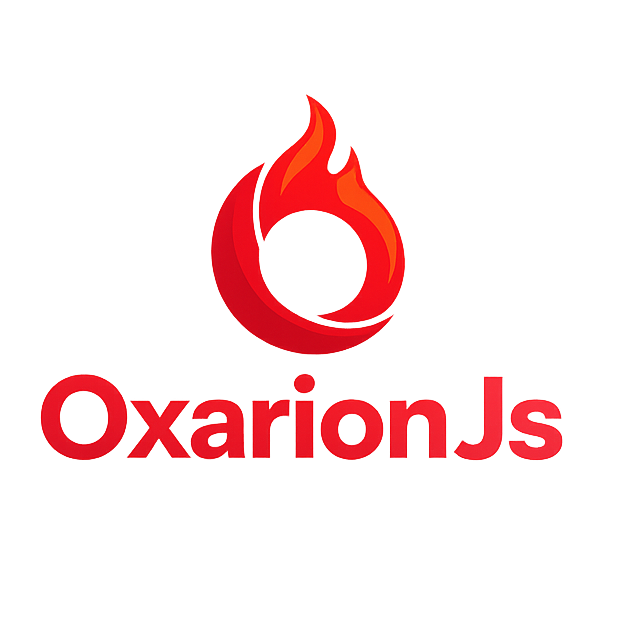

<p align="center">
  
</p>

<p align="center">
  "Because going faster shouldn’t mean writing more nonsense"
</p>

<p align="center">
  <a href="https://www.npmjs.com/package/oxarionjs">
    
  </a>
  <a href="./LICENSE">
    
  </a>
</p>

---

OxarionJs is a TypeScript-first backend framework built on Bun

It keeps the flow direct, the API clean, and the abstractions where they actually help

## Why OxarionJs

* Built on Bun for fast runtime and a tight development loop
* Type-safe route params
* Route groups and middleware chains
* Route injector for modular structure
* File-based dynamic routing
* Request and response helpers
* Native WebSocket route support
* Minimal flow without high-level clutter

## Install

```bash
bun add oxarionjs
```

## Quick start

```ts
import Oxarion, { Middleware } from "oxarionjs"

await Oxarion.start({
  host: "127.0.0.1",
  port: 3000,
  httpHandler: (router) => {
    router.addHandler("GET", "/", (_req, res) => {
      res.json({ message: "Welcome to OxarionJs" })
    })
  },
  safeMwRegister: (router) => {
    router.multiMiddleware("/", [Middleware.cors(), Middleware.logger()], true)
  },
})
```

Run it with

```bash
bun run src/index.ts
```

## Dynamic routing

```ts
import Oxarion from "oxarionjs"

await Oxarion.start({
  dynamicRouting: {
    dir: "dyn",
    handlerFile: "api",
    extensions: ["ts", "js"],
    onConflict: "keepManual",
  },
  httpHandler: () => {},
})
```

`dyn/test/api.ts` maps to `/test`

Route modules can export HTTP method functions or a static class

```ts
import { OxarionResponse, type OxarionRequest } from "oxarionjs"

export default class TestApi {
  static async GET(req: OxarionRequest, _res: OxarionResponse) {
    return OxarionResponse.json({ path: req.url() })
  }
}
```

## Docs

Start here if you want the full guide

* [Docs index](./docs/index.md)
* [Getting started](./docs/getting_started.md)
* [Server options](./docs/server_options.md)
* [Routing](./docs/routing.md)
* [Route Injector](./docs/route_injector.md)
* [Dynamic routing](./docs/dynamic_routing.md)
* [Middleware](./docs/middleware.md)
* [Request and response](./docs/request_and_response.md)
* [WebSocket](./docs/websocket.md)
* [API reference](./docs/api_reference.md)
* [Testing and benchmarking](./docs/testing_and_benchmarking.md)

## License

[MIT](./LICENSE)
